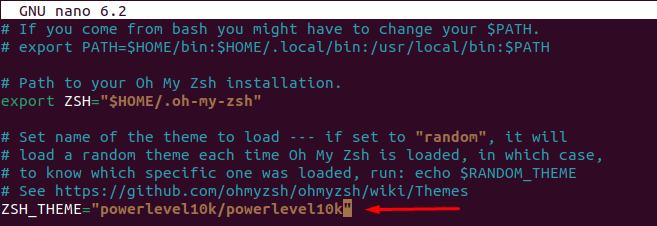
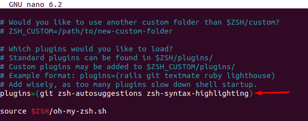
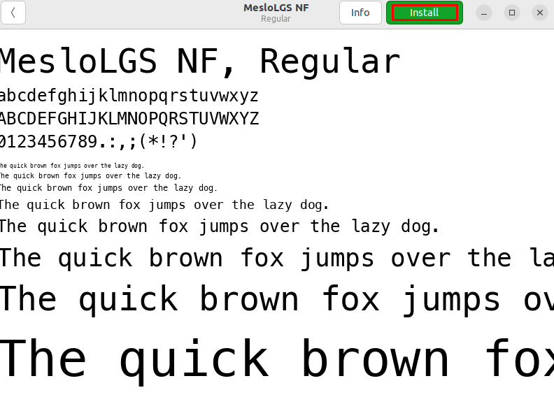
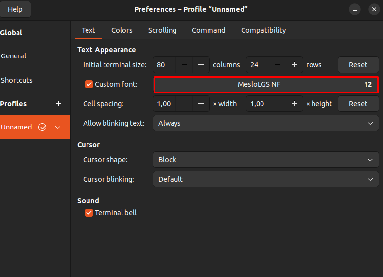
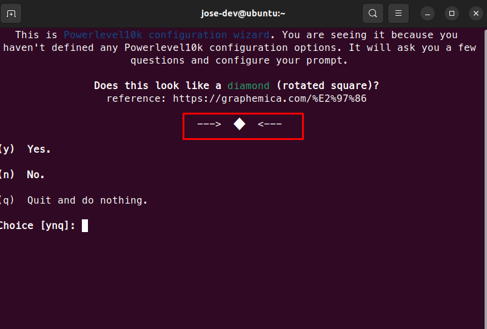
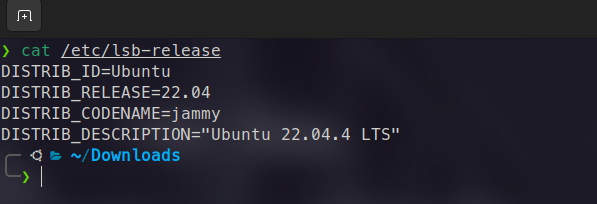

## Instalar ZSH
```bash
sudo apt install zsh
```
## Instalar Oh My Zsh!
```bash
sh -c "$(wget https://raw.githubusercontent.com/ohmyzsh/ohmyzsh/master/tools/install.sh -O -)"
```
## Instalar los siguientes plugins
### zsh-autosuggestions
```bash
git clone https://github.com/zsh-users/zsh-autosuggestions ${ZSH_CUSTOM:-~/.oh-my-zsh/custom}/plugins/zsh-autosuggestions
```
### zsh-syntax-highlighting
```bash
git clone https://github.com/zsh-users/zsh-syntax-highlighting.git ${ZSH_CUSTOM:-~/.oh-my-zsh/custom}/plugins/zsh-syntax-highlighting
```
## Instalar el tema PowerLevel10k
```bash
git clone --depth=1 https://github.com/romkatv/powerlevel10k.git ${ZSH_CUSTOM:-$HOME/.oh-my-zsh/custom}/themes/powerlevel10k
```
## Configurar el archivo ~/.zshrc
### Cambiamos el tema "robbyrussell" por "powerlevel10k/powerlevel10k"
```bash
ZSH_THEME="powerlevel10k/powerlevel10k"
```

### Líneas abajo agregamos los plugins que previamente instalamos:
```bash
plugins=(git zsh-autosuggestions zsh-syntax-highlighting)
```

## Instalamos la fuente MesloLGS NF Regular.ttf
```bash
wget https://github.com/romkatv/powerlevel10k-media/raw/master/MesloLGS%20NF%20Regular.ttf
```

## Cambiamos la fuente a MesloLGS NF

### Seguimos la siguiente secuencia yyy1y11112143121y1y para obtener nuestra terminal personalizada.

## Terminal Personalizada
